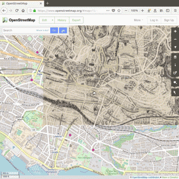
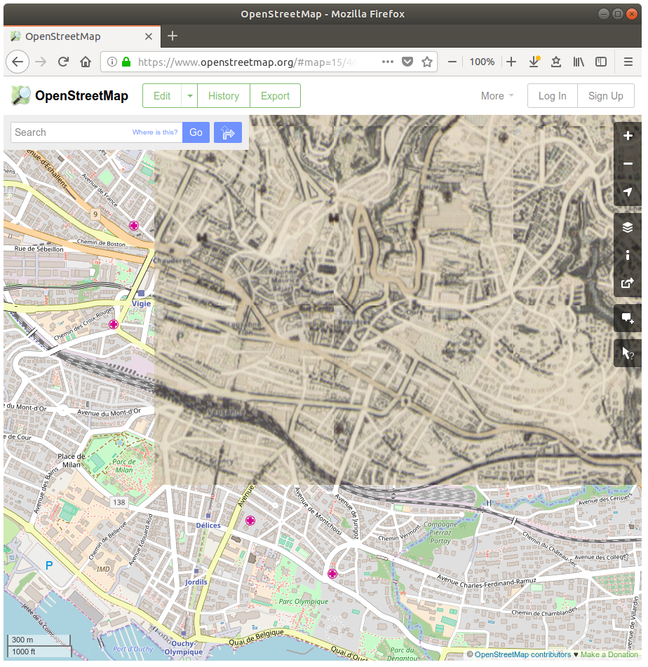

## DeepMaps

Browse online maps as if they were hand-drawn in the 19th century!



Or train a CycleGAN or style-transfer machine learning model and restyle OpenStreetMap to anything!

### Try it

Just install [the Firefox extension](https://addons.mozilla.org/firefox/addon/deepmaps/)! You'll be able to try style-transfer models in the browser. For the better looking CycleGAN model, you'll need to setup machine learning tools on your computer.

### What is this?

This is an interactive experience that allows you to browse OpenStreetMap rendered in an alternative style, on-demand by a neural network.

The Firefox extension can work in two ways:

1.  By generating images on-demand in the browser using style-transfer.
2.  By querying a local server for replacement images.

In the second case the project is composed of 3 main parts:

- A PyTorch CycleGAN machine learning model
- A local server that wraps around this model to convert given images and send the generated images back...
- ...to a Firefox extension that injects the generated tiles in [openstreetmap.org](openstreetmap.org).

### Video demo

Here : [https://twitter.com/genekogan/status/1048239707124125699](https://twitter.com/genekogan/status/1048239707124125699)

# How to

### Install

Clone this repository and follow the [instructions](server/README.md) by the CycleGAN teams. Additionally, you'll have to [side-load](https://developer.mozilla.org/en-US/docs/Mozilla/Add-ons/WebExtensions/Alternative_distribution_options/Sideloading_add-ons#Using_Install_Add-on_From_File) the Firefox extension in `extensions/maps-replacer`.

### Get a dataset

_Only required if you want to train your own model._

Download my dataset here:
[Download dataset](https://www.dropbox.com/s/3k54v4eelgg5m6e/dataset-oldstylemaps-2018-10-06.zip?dl=0)

Or create your own following the [guidelines](server/README.md) by the CycleGAN team. I have some additional tips in [Preparing datasets](PreparingDatasets.md).

### Train

Download my pre-trained model here:
[Download model](https://www.dropbox.com/s/znpnhqhwrx47ern/model-oldstylemaps-2018-10-06.zip?dl=0)

Or train your own like you would normally with `train.py` according to the [instructions](server/README.md) by the CycleGAN team.

### Run

Once you've
`cd server/`,
you can launch the server+model with:

```
python servemaps.py --dataroot ./datasets/oldstylemaps --name oldstylemaps_cyclegan
```

The options available are the same as the one [described](server/README.md) for the original CycleGAN code for `test.py`. You can see them all in `server/options/`.
The images will be served from `http://localhost:8080`.

Enable the extension in Firefox and open [openstreetmap.org](openstreetmap.org)!

## FAQ

#### Browser compatibility?

Only Firefox is supported, because Chrome doesn't allow to tamper with the content of network requests.

#### Google Maps support?

Google Maps has a lot of protections, optimizations and features that make it harder to alter their rendered style, so I didn't insist on trying to make it work on their website.

#### Is it possible to run the server on the CPU, without NVidia, CUDA, etc.?

Yes, but it will be even slower. Just pass `--gpu_ids -1` when running `servemaps.py`.

## LICENSE

This project is licensed under the terms of the MIT license.
Copyright 2018 Nathan Vogel
This project was initiated during a workshop led by Gene Kogan at ECAL.
