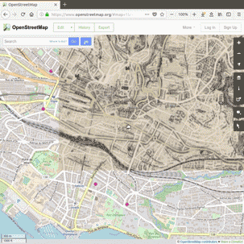
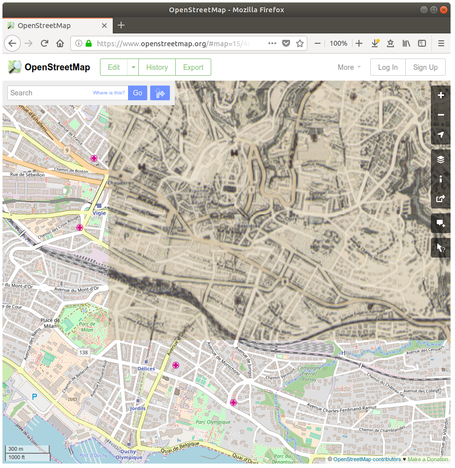

## DeepMaps

Browse online maps as if they were hand drawn in the 16th century!



Or train a machine learning CycleGAN model on your own dataset and restyle OpenStreetMap to anything!

### What is this?

This is an interactive experience that allows you to browse OpenStreetMap rendered in an alternative style, on-demand by a neural network. The project is composed of 3 main parts:
 - A PyTorch CycleGAN machine learning model
 - A local server that wraps around this model to convert given images and send the generated images back...
 - ...to a Firefox extension that injects the generated tiles in [openstreetmap.org](openstreetmap.org).

## How to

### Install

Follow the [instructions](server/README.md) by the CycleGAN teams. Additionally, you'll have to [side-load](https://developer.mozilla.org/en-US/docs/Mozilla/Add-ons/WebExtensions/Alternative_distribution_options/Sideloading_add-ons#Using_Install_Add-on_From_File) the Firefox extension in `extensions/maps-replacer`.


### Get a dataset

Only required if you want to train your own model.

Download my dataset here:

Or create your own following the [guidelines](server/README.md) by the CycleGAN team. I have some additional tips in [Preparing datasets](PreparingDatasets.md).


### Train

Download my pre-trained model here:

Or train your own like you would normally with `train.py` according to the [instructions](server/README.md) by the CycleGAN team.


### Run
Once you've
`cd server/`,
you can launch the server+model with:


```
python servemaps.py --dataroot ./datasets/oldstylemaps --name oldstylemaps_cyclegan
```
The options available are the same as the one [described](server/README.md) for the original CycleGAN code for `test.py`. You can see them all in `server/options/`.
The images will be served from `http://localhost:8080`.

Enable the extension in Firefox and open [openstreetmap.org](openstreetmap.org)!


## FAQ

#### Browser compatibility?

Only Firefox is supported, because Chrome doesn't allow to tamper with the content of network requests.


#### Google Maps support?

Google Maps has a lot of protections, optimizations and features that make it harder to alter their rendered style, so I didn't insist on trying to make it work on their website.
